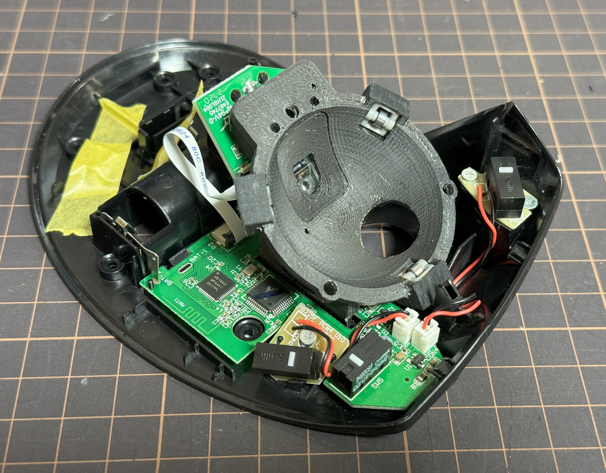
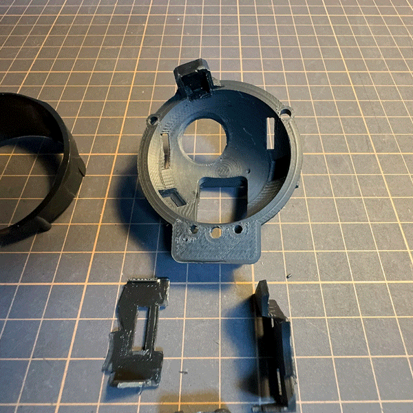

# DEFTPRO_BU_MOD

エレコム[DeftPro](https://www.elecom.co.jp/products/M-DPT1MRBK.html)用の人工ルビー支持球を[ベアリングユニットM-BS10](https://www.elecom.co.jp/products/M-BS10.html)に置きかえるための3Dモデルを公開しています。 
* deftpro_cup.stl :: ベアリングユニットを乗せるためのモデルです。 
* deftpro_cup_sensor.stl :: センサー用のPCBを固定するためのモデルです。 
* deftpro_LEFT.stl :: カップ保持のための足モデルです。 
* deftpro_RIGHT.stl :: カップ保持のための足モデルです。 
 
ベアリングユニットの微妙な位置はプラ板や薄いスペーサーなどを使って位置を調整してください。
組み立て時に元のモデルの一部をカットしたり、プリントしたモデルをやすりなどで整形する必要があります。 
（元のプラ造形がかなり薄いためFDMタイプでは同じ厚みで造形できない） 
プリンタの精度にも依存するので適宜調整してください。 
 
４つのモデルを組み合わせて使用します。 
 
 

- ベアリングユニットはエレコムIST用のベアリングを想定しています。IST用の交換ベアリングユニット(M-BS10)は別途入手してください。
- 分解・改造を伴うため、製品の保証はなくなります。
- ベアリングユニット換装に伴い発生する事象についていかなる責任も負いかねるのですべて自己責任でお願いします。
 

trackball cup for Elecom Deft Pro.
